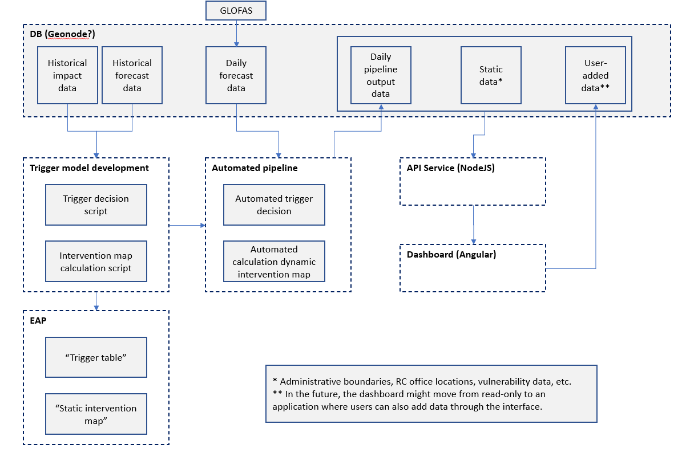

# IBF-system

**NOTE**: For now some background on IBF-terminology (e.g. triggers) is
expected. This can be expanded on later.

This is the repository for the IBF-system. It includes 3 main components.

1. [Trigger model development](./trigger-model-development/)

-   This contains the exploratory analysis for developing a trigger-model for a
    given country and disaster-type.
-   It might include (in the future) a lot of shared code between countries and
    disaster types, and even (automated) tools to aid analysts to develop
    trigger models.
-   The output is a `trigger script` which determines (per country/disaster
    type) when and where a trigger is reached.

2. [Services (backend)](./services/)

-   The `trigger script` is subsequently automated through (e.g. a daily
    running) service.
-   Results (as well as other related data) are stored in a database
-   Database content is returned through API-calls to some interface

3. [Interfaces (frontend)](./interfaces/)

-   Visualization of model results through dashboards
-   Dashboards might move from read-only to write-applications, where users can
    also add (secondary) data through an interface

## System design (draft)



## Installation using Docker

```
docker-compose -f docker-compose.yml up # for production

docker-compose up # for development

docker-compose -f docker-compose.yml -f docker-compose.override.yml up # for development (explicit)
```

These commands will install the IBF-system with listeners at,

1. [localhost](http://localhost) for the web server
2. \*development only - [localhost:4200](http://localhost:4200) for the web
   interface
