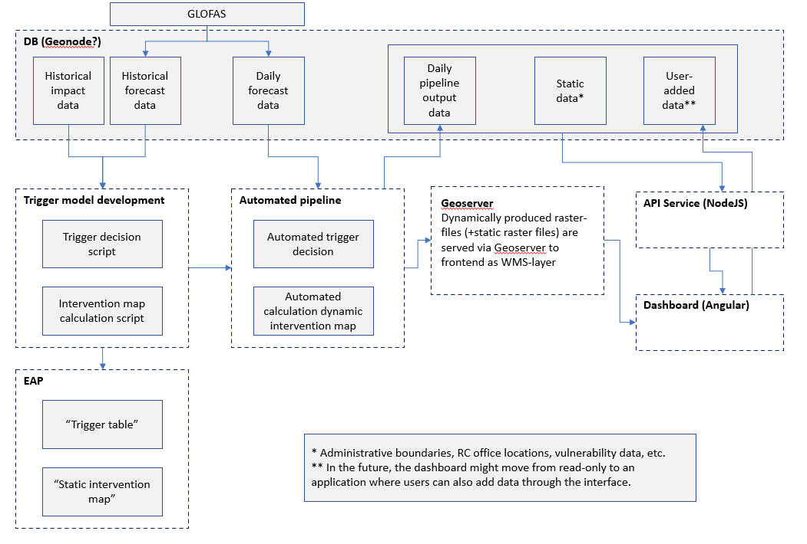

# IBF-system

## Status

| Component                 | Build Status                                                                                                                                                                              |
| ------------------------- | ----------------------------------------------------------------------------------------------------------------------------------------------------------------------------------------- |
| Cypress Integration Tests |  |

## Introduction

**NOTE**: Some background on IBF-terminology (e.g. triggers) is
expected. This can be expanded on later.

This is the repository for the IBF-system. It includes a.o.:

1. An [API-service (backend)](./services/API-service/)

- which accepts input from various IBF-pipelines, that upload impact forecast data to the IBF-system on regular intervals. (See 'Dependencies' below.)
- and which lets the IBF-dashboard - or other authorized accounts - retrieve data from the IBF-database.

2. An [IBF-dashboard (frontend)](./interfaces/IBF-dashboard/)

- showing all impact forecast data - either leading to a trigger or not - in the IBF-portal

3. A [features](./features/) folder describing all feature scenarios in the IBF-system, using Gherking language.

4. A [docs](./docs) folder with further documentation beyond this readme.

## Dependencies

- The IBF-dashboard will not show meaningful information (or even load correctly) without impact forecast data being uploaded to it.
- This data is provided by separate IBF-pipelines, that are not part of this repository, but are strongly connected.
- See the 510 IBF Project Document for more info and links to the 510-instances of these pipelines per disaster-type.
- For development/testing purposes, there are mock-endpoints and mock-data available to replace the need for these pipelines. (See 'Load local database with data' below.)

## System design

## Getting Started

### Setup a local development-environment:

- Install Git: <https://git-scm.com/download/>
- Install Node.js: <https://nodejs.org/en/download/>

  - Install the version specified in the [`.node-version`](.node-version)-file.
  - To prevent conflicts between projects or components using other versions of Node.js it is recommended to use a 'version manager'.

    - [NVM - Node Version Manager](http://nvm.sh/) (for macOS/Linux).

    - [NVM for Windows](https://github.com/coreybutler/nvm-windows) (for Windows)

    - [FNM](https://nodejs.org/en/download/package-manager/#fnm) (for Windows/macOS/Linux)

### Installation

1. Clone the repository

2. Setup env variables:

   `cp example.env .env`

   Fill in the .env variables with someone who has them.

3. Run `npm run install:interface` 

### Start apps

From root run

- `npm run start:services`
- `npm run start:interface`

### Load (local) database with data

When running Docker locally, a database-container will start (as opposed to remote servers, which
are connected to a database-server). For setting up a fully working version of the IBF-dasbhoard 2 steps are needed.

1. Load initial raster data

- Get the file `raster-files.zip` from [this folder](https://rodekruis.sharepoint.com/sites/510-CRAVK-510/Gedeelde%20%20documenten/Forms/AllItems.aspx?id=%2Fsites%2F510%2DCRAVK%2D510%2FGedeelde%20%20documenten%2F%5BRD%5D%20Impact%2Dbased%20forecasting%2FGeneral%5FData%2FProduction%20Data&p=true&originalPath=aHR0cHM6Ly9yb2Rla3J1aXMuc2hhcmVwb2ludC5jb20vc2l0ZXMvNTEwLUNSQVZLLTUxMC9fbGF5b3V0cy8xNS9ndWVzdGFjY2Vzcy5hc3B4P2ZvbGRlcmlkPTBmYTQ1NGU2ZGMwMDI0ZGJkYmE3YTE3ODY1NWJkYzIxNiZhdXRoa2V5PUFjcWhNODVKSFpZOGNjNkg3QlRLZ08wJmV4cGlyYXRpb249MjAyMS0xMS0yOVQyMyUzYTAwJTNhMDAuMDAwWiZydGltZT1zekJQVnJfSjJFZw).
- Unzip it in `services/API-service/geoserver-volume/raster-files` folder, such that that folder now has subfolders:
  - `input`-folder: static raster files that are served through 'geoserver' to the 'IBF-dashboard'
  - `mock-output`-foldermock output raster files that are used by the mock-endpoint (see below)
  - `output`-folder: currently empty, but any raster files that are posted to the API-service by IBF-pipelines (or mock endpoint) will be stored here, and Geoserver will be able to read them from here.

2. Post static data and 1st batch of dynamic data to database

- login http://localhost:4000/docs#/--%20user%20--/UserController_login (click Try it out, fill in your username and password, and click Execute)
  - Copy the resulting `user.token` of that api call
  - Paste it to the Authorize button button at the top of that page
- by calling mock-endpoint
  - see API documentation: http://localhost:4000/docs/#/scripts
  - run for all countries and disaster-type at once: http://localhost:4000/docs/#/scripts/ScriptsController_mockAll
  - or run for 1 country and 1 disaster-type: http://localhost:4000/docs/#/scripts/ScriptsController_mockDynamic
- or by having external pipeline make a call to IBF-system

### Installation result

These commands will install the IBF-system with listeners at,

1. [localhost:4000/docs](http://localhost:4000/docs) for the API-service documentation
2. \*development only - [localhost:4200](http://localhost:4200) for the web
   interface

### Troubleshoot installation issues

Please read the troubleshoot guidlelines to support the insatllation of IBF in the
[TROUBLESHOOT.md](/docs/TROUBLESHOOT.md)

## Integration tests

### Cypress (THE USE OF CYPRESS IS DEPRECATED FOR IBF)

We use Cypress for automated integration testing in this project.
Installation:

0. (Potentially on Ubuntu?:
   `sudo apt-get install libgtk2.0-0 libgtk-3-0 libgbm-dev libnotify-dev libgconf-2-4 libnss3 libxss1 libasound2 libxtst6 xauth xvfb`)

1. In root folder `npm install --only=dev`

   - This should download and install Cypress
   - If it fails, find out why and/or install Cypress in some other way (e.g.
     `npm install cypress`)

2. Set necessary environment variables by copying `cypress.env.json.example` to `cypress.env.json` and filling in the variables.

3. Run `npm run cypress:open`

   - When the Cypress window opens click on 'Run X integration specs'
   - Alternatively run `npm run cypress:start` to run from commandline

## Releases

See notable changes and the currently released version in

- [CHANGELOG](CHANGELOG.md), which is automatically created based on commit messages
- [What's new in IBF](./WHAT_IS_NEW_IN_IBF.md), which is manually created at every release (see also release checklist below)

### Release Checklist

- [ ] Check if the latest integration tests passed on
      [Cypress Dashboard](https://dashboard.cypress.io/projects/jkaw7k/runs?branches=%5B%5D&committers=%5B%5D&flaky=%5B%5D&page=1&status=%5B%5D&tags=%5B%5D&timeRange=%7B%22startDate%22%3A%221970-01-01%22%2C%22endDate%22%3A%222038-01-19%22%7D).
- [ ] Pick a tag to release. Generally this is the latest tag in [tags](https://github.com/rodekruis/IBF-system/tags).
- [ ] Click the 'Create release' button.
- [ ] Enter as release title the tag-name (e.g. v0.128.5).
- [ ] **IMPORTANT**: Before actually doing the release (and thus releasing to `staging`), check if any .ENV-variables on the server need to be updated. Do that by SSH'ing into the server and making the required changes. This will make sure the new release will use the updated .ENV-variables immediately.
- [ ] Click the 'Publish Release' button.
- [ ] **IMPORTANT**: Add changes relevant to the end-user in [What's new in IBF](./WHAT_IS_NEW_IN_IBF.md)

The above steps should trigger the
[release webhook](https://github.com/rodekruis/IBF-system/settings/hooks/240449523)
which updates the [staging environment](https://ibf.510.global/login) to the
published release. This takes a while (approx 20 mins) to update.

## Deployment

### To "test" environment

- Make sure to verify if the environment-settings are appropriately set on the
  test VM before merging the PR.
- Merging a PR to master will lead to creation of a new tag (e.g. v0.128.5), but ONLY if the PR includes at least 1 commit with a commit message starting with 'feat: ' or 'fix: ' (following [Conventional Commit](https://conventionalcommits.org/))
- The tag creation in turn will lead to an automatic deploy to the test-server (via [webhook](tools/webhook.service), see:
  [/tools#GitHub-webhook](tools/README.md#github-webhook))
- Wait until deploy is ready (by checking when the new version-number has appeared on the login-page of IBF-dashboard)
- Run seed-script
- Run 'mock-all' endpoint

### To "stage" environment

- Make sure to verify if the environment-settings are appropriately set on the
  stage VM before publishing the release.
- When a [release](#release-checklist) is published, it is automatically
  deployed to the staging-server.
- Wait until deploy is ready (by checking when the new version-number has appeared on the login-page of IBF-dashboard)
- Note that the deployment logs can be followed in `/var/tmp/ibf-<yyyy-mm-dd>.stdout.log`
- Run seed-script
- Run 'mock-all' endpoint

### To "production" environment

- SSH into the production server
- Make sure to verify if the [environment variables](./example.env) are
  appropriately set on the VM.
- Currently the deploy-script must be run in sudo-mode. See [this section](/docs/TROUBLESHOOT.md#running-deploy-script-not-in-sudo-mode) of the TROUBLESHOOT guide.
- Manually run the [deploy script](./tools/deploy.sh) with the tag which
  should be deployed for the specific country.
- Sometimes npm packages are not all automatically correctly installed. In case of issues with the api-service restart after deployment has finished, check the [this section](/docs/TROUBLESHOOT.md#install-packages-in-api-service) of the TROUBLESHOOT guide

## Contributing to IBF

Please read the contributing guidlelines in the
[CONTRIBUTING.md](docs/CONTRIBUTING.md)

## Glossary

| Term          | Definition (_we_ use)                                                                                     |
| ------------- | --------------------------------------------------------------------------------------------------------- |
| `version`     | A 'number' specified in the [`SemVer`](https://semver.org/spec/v2.0.0.html)-format: `0.1.0`               |
| `tag`         | A specific commit or point-in-time on the git-timeline; named after a version, i.e. `v0.1.0`              |
| `release`     | A fixed 'state of the code-base', [published on GitHub](https://github.com/rodekruis/IBF-system/releases) |
| `deployment`  | An action performed to get (released) code running on an environment                                      |
| `environment` | A machine that can run code (with specified settings); i.e. a server or VM, or your local machine         |
