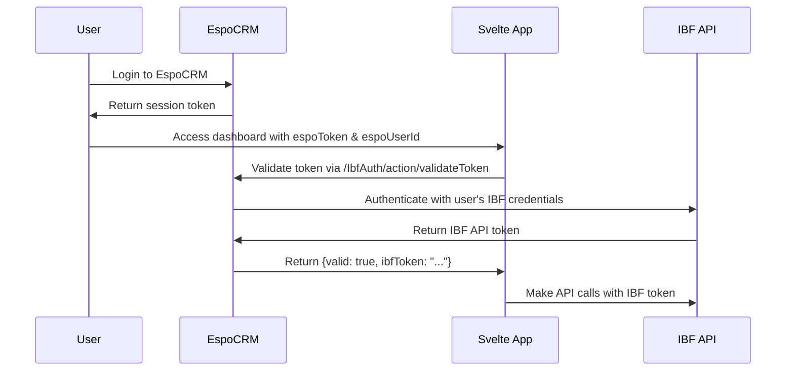

# IBF Svelte Dashboard - Azure Deployment Guide

## Overview
This guide provides the exact steps to deploy the IBF Svelte Dashboard to Azure Static Web Apps, replacing the existing application.

## Prerequisites
- Azure CLI installed and authenticated
- Node.js and npm installed
- Access to the Azure subscription "510 - General"
- Resource group: `rg-ibf-svelte-dashboard` (already exists)

## Deployment Steps

### 1. Authenticate with Azure
```bash
az account show
```
Verify you're logged into the correct subscription: "510 - General"

### 2. Navigate to Project Directory
```bash
cd "c:\Users\MaartenvV\OneDrive - Rode Kruis\Documenten\GitHub\IBF-system\interfaces\IBF-svelte"
```

### 3. Build the Application
```bash
npm run build
```
This creates the production build in the `dist/` folder.

### 4. Deploy Infrastructure (First Time Only)
```bash
az deployment group create \
  --resource-group "rg-ibf-svelte-dashboard" \
  --template-file "infra/main.bicep" \
  --parameters environmentName="ibf-svelte-prod" \
               location="westeurope" \
               resourceGroupName="rg-ibf-svelte-dashboard"
```

**Note**: This step only needs to be done once or when infrastructure changes are needed.

### 5. Get Static Web App Deployment Token
```bash
az staticwebapp secrets list --name "swa-XXX" --resource-group "rg-ibf-svelte-dashboard" --query "properties.apiKey" --output tsv
```
Replace `swa-XXX` with the actual Static Web App name from the deployment output.

### 6. Install Azure Static Web Apps CLI (First Time Only)
```bash
npm install -g @azure/static-web-apps-cli
```

### 7. Deploy Application to Production
```bash
swa deploy ./dist --deployment-token "YOUR_DEPLOYMENT_TOKEN" --env production
```
Replace `YOUR_DEPLOYMENT_TOKEN` with the token from step 5.

## Infrastructure Details

### Resources Created
- **Static Web App**: Hosts the Svelte application
- **Application Insights**: Monitoring and logging
- **Log Analytics Workspace**: Centralized logging
- **Key Vault**: Secret management (for future use)

### Static Web App Configuration
- **Location**: West Europe
- **SKU**: Free tier
- **Build Command**: `npm run build`
- **Output Location**: `dist`
- **App Location**: `/` (root directory)

## Environment Configuration

### Production Environment Variables
The application uses these environment variables (in `.env.production`):
```bash
VITE_DISABLE_AUTHENTICATION=false
VITE_USE_MOCK_DATA=false
VITE_USE_IBF_API=true
VITE_API_URL=https://ibf-test.510.global/api
VITE_ESPOCRM_API_URL=https://crm.510.global/api/v1
VITE_DEBUG_MODE=true
VITE_SHOW_DEBUG_PANEL=true
VITE_DISABLE_API_CACHE=false
```

## EspoCRM Integration

The application is configured for EspoCRM integration with enhanced authentication flow:

### Authentication Flow
1. **URL Parameter Detection**: App checks for `espoToken` and `espoUserId` parameters
2. **Token Validation**: Calls `https://crm.510.global/api/v1/IbfAuth/action/validateToken?token={token}&userId={userId}`
3. **IBF Token Retrieval**: EspoCRM controller authenticates with IBF API and returns IBF token
4. **Response Handling**: 
   - If `{"valid": true, "ibfToken": "..."}` → User is automatically authenticated with IBF token
   - If `{"valid": false}` → User sees normal login popup

### Fullscreen Behavior
The application adapts its fullscreen functionality based on context:

- **When running in EspoCRM iframe**: Only the EspoCRM dashlet fullscreen button is shown
- **When running standalone**: IBF app's native fullscreen button is displayed
- **Smart detection**: App automatically detects iframe context and adjusts UI accordingly

### Required EspoCRM Configuration
For each user needing IBF Dashboard access:
1. **IBF Email** (`ibfEmail`): Custom field with user's IBF system email
2. **IBF Password** (`ibfPassword`): Custom field with user's IBF system password (encrypted)
3. **User Setup**: EspoCRM user must have valid IBF credentials configured

### Token Management
- **EspoCRM Token**: Validates user session in EspoCRM
- **IBF API Token**: Retrieved fresh on each validation for security
- **Token Expiration**: IBF tokens can expire and are re-requested as needed
- **Fallback**: Standard login popup if EspoCRM validation fails

## Updating the Application

### For Code Changes Only
1. Build the application: `npm run build`
2. Deploy to Static Web App: `swa deploy ./dist --deployment-token "YOUR_DEPLOYMENT_TOKEN" --env production`

### For Infrastructure Changes
1. Update the Bicep template in `infra/main.bicep`
2. Redeploy infrastructure using the Azure CLI command from step 4
3. Redeploy application using steps 1 and 2 above

## Troubleshooting

### Common Issues
1. **Build Failures**: Check that all dependencies are installed with `npm install`
2. **Deployment Token Issues**: Regenerate the token using step 5
3. **Environment Variables**: Ensure `.env.production` has correct values

### EspoCRM Integration Issues
1. **Token Validation Fails**: 
   - Check EspoCRM cache is cleared
   - Verify custom controller is deployed correctly
   - Check routes.json has noAuth: true
2. **IBF Token Retrieval Fails**:
   - Verify user has `ibfEmail` and `ibfPassword` fields configured
   - Check IBF API credentials are valid
   - Review EspoCRM error logs for API connection issues
3. **Slow Response**: 
   - IBF API timeout is set to 10 seconds
   - Check network connectivity between EspoCRM and IBF API
   - Consider caching IBF tokens if performance is critical

### Getting Deployment URL
```bash
az staticwebapp show --name "swa-XXX" --resource-group "rg-ibf-svelte-dashboard" --query "defaultHostname" --output tsv
```

### Checking Deployment Status
```bash
az staticwebapp show --name "swa-XXX" --resource-group "rg-ibf-svelte-dashboard" --query "repositoryUrl,defaultHostname"
```

## Complete Integration Workflow

### 1. User Setup Process
1. **Create IBF Account**: User must have valid credentials in IBF system
2. **Configure EspoCRM User**: 
   - Add `ibfEmail` field with user's IBF email
   - Add `ibfPassword` field with user's IBF password (encrypted)
3. **Deploy EspoCRM Controller**: Custom `IbfAuth` controller with token validation
4. **Test Integration**: Verify token validation and IBF token retrieval

### 2. Authentication Flow


### 3. Security Considerations
- **No Stored Credentials**: IBF credentials only in EspoCRM, not in frontend
- **Token Freshness**: IBF tokens requested fresh on each validation
- **Encrypted Storage**: IBF passwords encrypted in EspoCRM database
- **Fast Response**: 10-second timeout for IBF authentication to prevent UI blocking

## Monitoring

- **Application Insights**: Automatic performance and error monitoring
- **Log Analytics**: Centralized logging for troubleshooting
- **Azure Portal**: Real-time metrics and diagnostics

## Support

For issues with:
- **EspoCRM Integration**: See `espocrm-integration.md`
- **Authentication**: Check authService.ts implementation
- **API Integration**: Review IBF API configuration

## Resource Names

All Azure resources use the pattern: `{service}-{unique-token}`
- Static Web App: `swa-{token}`
- Application Insights: `ai-{token}`
- Log Analytics: `law-{token}`
- Key Vault: `kv-{token}`

Where `{token}` is generated based on subscription, resource group, and environment name.
