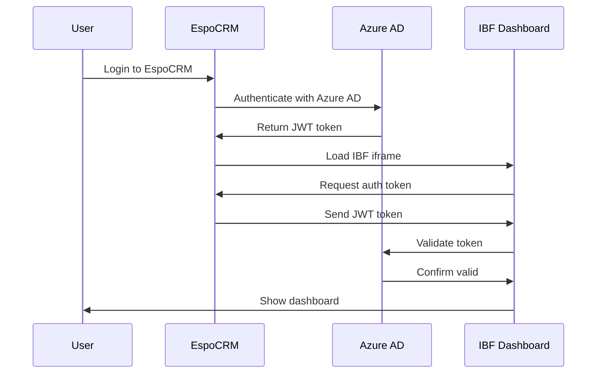

# EspoCRM IBF Dashboard Integration Guide

This guide shows how to securely integrate the IBF Svelte dashboard into EspoCRM using Azure AD authentication.

## 🔐 Security Overview

The integration uses Azure AD OAuth2 tokens passed from EspoCRM to the IBF dashboard iframe for secure authentication.



## 1. EspoCRM Custom View Implementation

### Create Custom IBF Widget

Create a new file: `custom/Espo/Custom/Resources/metadata/clientDefs/IBFWidget.json`

```json
{
  "views": {
    "ibfDashboard": "custom:views/ibf-dashboard"
  }
}
```

### IBF Dashboard View (JavaScript)

Create: `client/custom/src/views/ibf-dashboard.js`

```javascript
define('custom:views/ibf-dashboard', ['view'], function (View) {
    
    return View.extend({
        
        template: 'custom:ibf-dashboard',
        
        data: function () {
            return {
                ibfUrl: this.getConfig().get('ibfDashboardUrl') || 'https://your-ibf-domain.com',
                country: this.model.get('country') || 'ETH',
                height: this.options.height || '600px'
            };
        },
        
        setup: function () {
            View.prototype.setup.call(this);
            
            // Listen for messages from IBF iframe
            this.messageHandler = this.handleIBFMessage.bind(this);
            window.addEventListener('message', this.messageHandler);
        },
        
        afterRender: function () {
            View.prototype.afterRender.call(this);
            
            // Initialize iframe communication
            setTimeout(() => {
                this.initializeIBFDashboard();
            }, 1000);
        },
        
        onRemove: function () {
            window.removeEventListener('message', this.messageHandler);
            View.prototype.onRemove.call(this);
        },
        
        initializeIBFDashboard: function () {
            const iframe = this.$el.find('#ibf-iframe')[0];
            if (!iframe) return;
            
            // Send initial configuration to iframe
            iframe.addEventListener('load', () => {
                this.sendConfigurationToIBF();
            });
        },
        
        sendConfigurationToIBF: function () {
            const iframe = this.$el.find('#ibf-iframe')[0];
            if (!iframe) return;
            
            // Get current user's Azure AD token
            this.getAzureADToken().then(token => {
                if (token) {
                    iframe.contentWindow.postMessage({
                        type: 'IBF_AUTH_TOKEN',
                        token: token,
                        config: {
                            country: this.model.get('country'),
                            theme: this.getConfig().get('theme') || 'light',
                            allowFullscreen: true
                        }
                    }, '*');
                } else {
                    iframe.contentWindow.postMessage({
                        type: 'IBF_AUTH_ERROR',
                        error: 'No authentication token available'
                    }, '*');
                }
            });
        },
        
        getAzureADToken: function () {
            return new Promise((resolve) => {
                // Get token from EspoCRM's Azure AD integration
                Espo.Ajax.getRequest('AzureAD/token').then(response => {
                    resolve(response.access_token);
                }).catch(error => {
                    console.error('Failed to get Azure AD token:', error);
                    resolve(null);
                });
            });
        },
        
        handleIBFMessage: function (event) {
            // Validate origin
            const allowedOrigins = [
                this.getConfig().get('ibfDashboardUrl'),
                'https://your-ibf-domain.com'
            ];
            
            if (!allowedOrigins.some(origin => event.origin.startsWith(origin))) {
                console.warn('Received message from unauthorized origin:', event.origin);
                return;
            }
            
            switch (event.data.type) {
                case 'IBF_REQUEST_AUTH':
                    this.sendConfigurationToIBF();
                    break;
                    
                case 'IBF_FEATURE_CLICK':
                    this.handleFeatureClick(event.data.data);
                    break;
                    
                case 'IBF_REQUEST_FULLSCREEN':
                    this.openFullscreenModal();
                    break;
                    
                case 'IBF_LOGOUT':
                    this.handleIBFLogout();
                    break;
            }
        },
        
        handleFeatureClick: function (featureData) {
            // Handle feature clicks - could update related records
            console.log('IBF feature clicked:', featureData);
            
            // Example: Update current record with selected location
            if (featureData.coordinate) {
                this.model.set({
                    'customLatitude': featureData.coordinate[1],
                    'customLongitude': featureData.coordinate[0]
                });
            }
        },
        
        openFullscreenModal: function () {
            // Open IBF dashboard in fullscreen modal
            this.createView('fullscreenModal', 'custom:views/ibf-fullscreen-modal', {
                country: this.model.get('country')
            }, (view) => {
                view.render();
            });
        },
        
        handleIBFLogout: function () {
            // Handle logout from IBF - could trigger EspoCRM logout
            console.log('IBF dashboard logout');
        }
    });
});
```

### IBF Dashboard Template

Create: `client/custom/res/templates/ibf-dashboard.tpl`

```html
<div class="ibf-dashboard-container">
    <iframe 
        id="ibf-iframe"
        src="{{ibfUrl}}?embedded=true&country={{country}}&hideHeader=true&height={{height}}"
        width="100%" 
        height="{{height}}"
        frameborder="0"
        sandbox="allow-scripts allow-same-origin allow-forms allow-popups"
        allow="fullscreen">
    </iframe>
</div>

<style>
.ibf-dashboard-container {
    position: relative;
    width: 100%;
    border: 1px solid #e3e3e3;
    border-radius: 4px;
    overflow: hidden;
}

.ibf-dashboard-container iframe {
    display: block;
    border: none;
    background: #f8f9fa;
}
</style>
```

## 2. Azure AD Token Provider (Backend)

Create: `custom/Espo/Custom/Controllers/AzureAD.php`

```php
<?php

namespace Espo\Custom\Controllers;

use Espo\Core\Controllers\Base;
use Espo\Core\Api\Request;
use Espo\Core\Api\Response;

class AzureAD extends Base
{
    public function getActionToken(Request $request): Response
    {
        // Check if user is authenticated
        if (!$this->getUser()->isAuthenticated()) {
            return $this->createUnauthorizedResponse();
        }
        
        // Get current user's Azure AD token from session/storage
        $token = $this->getAzureADTokenForUser();
        
        if (!$token) {
            return $this->createErrorResponse('No Azure AD token available');
        }
        
        return $this->createSuccessResponse([
            'access_token' => $token,
            'token_type' => 'Bearer',
            'expires_at' => $this->getTokenExpiration()
        ]);
    }
    
    private function getAzureADTokenForUser(): ?string
    {
        // Implementation depends on your Azure AD integration
        // This could come from:
        // 1. Session storage
        // 2. Database (encrypted)
        // 3. Azure AD SDK refresh
        
        $user = $this->getUser();
        
        // Example: Get from user preferences
        return $user->get('azureAdAccessToken');
    }
    
    private function getTokenExpiration(): int
    {
        // Return token expiration timestamp
        $user = $this->getUser();
        return $user->get('azureAdTokenExpires') ?: (time() + 3600);
    }
    
    private function createUnauthorizedResponse(): Response
    {
        return $this->createResponse([
            'error' => 'unauthorized',
            'message' => 'Authentication required'
        ], 401);
    }
    
    private function createErrorResponse(string $message): Response
    {
        return $this->createResponse([
            'error' => 'token_unavailable',
            'message' => $message
        ], 400);
    }
    
    private function createSuccessResponse(array $data): Response
    {
        return $this->createResponse($data);
    }
    
    private function createResponse(array $data, int $status = 200): Response
    {
        $response = new Response();
        $response = $response->withStatus($status);
        $response = $response->withHeader('Content-Type', 'application/json');
        $response->getBody()->write(json_encode($data));
        
        return $response;
    }
}
```

## 3. Security Configuration

### Content Security Policy

Add to your web server configuration:

```apache
# Apache .htaccess
Header always set Content-Security-Policy "frame-ancestors 'self' https://your-espocrm-domain.com; default-src 'self'; script-src 'self' 'unsafe-inline' https://login.microsoftonline.com; connect-src 'self' https://login.microsoftonline.com https://api.ibf-system.org; img-src 'self' data: https:; style-src 'self' 'unsafe-inline';"
```

```nginx
# Nginx configuration
add_header Content-Security-Policy "frame-ancestors 'self' https://your-espocrm-domain.com; default-src 'self'; script-src 'self' 'unsafe-inline' https://login.microsoftonline.com; connect-src 'self' https://login.microsoftonline.com https://api.ibf-system.org; img-src 'self' data: https:; style-src 'self' 'unsafe-inline';" always;
```

### CORS Configuration

```javascript
// Add to your API server (Express.js example)
app.use(cors({
    origin: [
        'https://your-espocrm-domain.com',
        'https://your-ibf-domain.com'
    ],
    credentials: true,
    methods: ['GET', 'POST', 'PUT', 'DELETE', 'OPTIONS'],
    allowedHeaders: ['Content-Type', 'Authorization', 'X-Requested-With']
}));
```

## 4. Usage Examples

### Add IBF Widget to Record Detail View

In your entity's clientDefs (e.g., `Contact.json`):

```json
{
    "views": {
        "detail": "custom:views/contact/detail"
    }
}
```

Create `client/custom/src/views/contact/detail.js`:

```javascript
define('custom:views/contact/detail', ['views/detail'], function (DetailView) {
    
    return DetailView.extend({
        
        setup: function () {
            DetailView.prototype.setup.call(this);
            
            // Add IBF dashboard panel
            this.addPanel('ibfDashboard', {
                view: 'custom:views/ibf-dashboard',
                label: 'Disaster Forecast',
                options: {
                    height: '500px'
                }
            });
        }
    });
});
```

### Dashboard Integration

Add to your EspoCRM dashboard:

```json
{
    "name": "IBFDashboard",
    "label": "Disaster Monitoring",
    "view": "custom:views/ibf-dashboard",
    "options": {
        "height": "600px"
    }
}
```

## 5. Testing & Validation

### Test Authentication Flow

1. **Login to EspoCRM** with Azure AD
2. **Navigate to IBF widget** - should load without additional login
3. **Check browser console** for any authentication errors
4. **Verify token validation** in IBF dashboard
5. **Test feature interactions** (map clicks, country selection)

### Security Checklist

- ✅ **HTTPS only** for all domains
- ✅ **CSP headers** configured properly
- ✅ **CORS settings** restrictive to known domains
- ✅ **Token validation** against Azure AD
- ✅ **Origin validation** for postMessage
- ✅ **Iframe sandbox** attributes set
- ✅ **No sensitive data** in URL parameters

## 6. Troubleshooting

### Common Issues

**Authentication fails:**
- Check Azure AD token expiration
- Verify tenant ID and client ID configuration
- Ensure user has proper roles assigned

**Iframe doesn't load:**
- Check CSP frame-ancestors policy
- Verify CORS configuration
- Check for JavaScript console errors

**PostMessage not working:**
- Verify origin validation logic
- Check allowed origins configuration
- Ensure iframe has loaded completely

### Debugging

Enable debug mode in both EspoCRM and IBF dashboard:

```javascript
// In EspoCRM console
localStorage.setItem('ibf-debug', 'true');

// In IBF dashboard console  
localStorage.setItem('debug', 'true');
```

This implementation provides enterprise-grade security for your IBF dashboard integration with EspoCRM! 🔐
