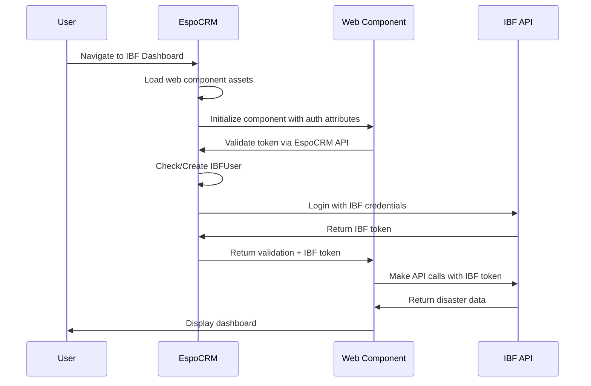

# EspoCRM IBF Dashboard Extension

A comprehensive EspoCRM extension that integrates the IBF (Impact-Based Forecasting) Dashboard directly into EspoCRM as a full-page application with advanced authentication and user management capabilities.

## 📋 Table of Contents

1. [Overview](#overview)
2. [Features](#features)
3. [Quick Start](#quick-start)
4. [Installation](#installation)
5. [Architecture](#architecture)
6. [User Management](#user-management)
7. [Migration Guide](#migration-guide)
8. [Configuration](#configuration)
9. [Development](#development)
10. [Production Deployment](#production-deployment)
11. [Troubleshooting](#troubleshooting)
12. [Security](#security)

## 🚀 Quick Start

### Building the Extension

```bash
# Create extension package with current version
./create-extension.sh

# Auto-increment version and create package
./create-extension.sh --patch    # 1.0.0 -> 1.0.1
./create-extension.sh --minor    # 1.0.0 -> 1.1.0  
./create-extension.sh --major    # 1.0.0 -> 2.0.0
```

### Deploying to Development/Test

```bash
# Deploy to development environment
./deploy-extension.sh --environment dev

# Deploy to test environment  
./deploy-extension.sh --environment test

# Interactive deployment (will prompt for environment)
./deploy-extension.sh
```

### Requirements

- **jq**: Required for JSON processing
  - Ubuntu/Debian: `apt-get install jq`
  - macOS: `brew install jq`
  - Windows: Available through package managers or direct download
- **zip**: Required for package creation (usually pre-installed)
- **ssh/scp**: Required for deployment to remote servers

## 🎯 Overview

This extension creates a dedicated IBF Dashboard page in EspoCRM that appears as a full-page tab in the EspoCRM navigation. The dashboard loads the IBF Dashboard web component natively with seamless authentication and user management through a dedicated IBFUser entity.

### Key Features
- ✅ **Native Web Component Integration**: Uses IBF Dashboard web component for optimal performance
- ✅ **Full-Page Integration**: Native EspoCRM page with standard navigation (not a dashlet)
- ✅ **IBFUser Entity**: Dedicated entity for managing IBF-specific user data and permissions
- ✅ **Automatic Authentication**: Token-based SSO between EspoCRM and IBF API
- ✅ **User Auto-Creation**: Automatically creates IBF users from EspoCRM users
- ✅ **Permission Management**: Country and disaster-type level access control
- ✅ **Production Ready**: Comprehensive error handling and logging

## ✨ Features

### Core Functionality
- **Native Web Component**: Uses the IBF Dashboard web component for better performance and integration
- **Full-Page Dashboard**: Native EspoCRM integration with no iframe limitations
- **IBF User Entity**: Dedicated entity for managing IBF-specific user data
- **Permission System**: Country and disaster-type level access control
- **Token-Based Authentication**: Secure authentication flow with EspoCRM
- **Admin Interface**: Complete CRUD interface for managing IBF users

### User Management Features
- **Automatic User Creation**: Option to auto-create IBF users from EspoCRM users
- **Manual User Management**: Admin interface for adding/editing IBF users
- **Permission Control**: Fine-grained access control by country and disaster type
- **User Mapping**: Link EspoCRM users to IBF credentials
- **Audit Trail**: Track user access and authentication events

## 🚀 Installation

### Option 1: Extension Package (Recommended)

1. **Create Extension Package**:
   ```bash
   # On Linux/Mac:
   ./deploy-extension.ps1
   
   # On Windows:
   .\deploy-extension.ps1
   ```

2. **Install via EspoCRM**:
   - Go to **Administration > Extensions**
   - Click **"Upload"** and select the generated `ibf-dashboard-extension-vX.X.X.zip`
   - Click **"Install"**
   - Clear cache and rebuild

### Option 2: Manual Installation

Deploy individual files to your EspoCRM installation:

```
espocrm/
├── client/custom/modules/ibf-dashboard/
│   ├── src/controllers/ibfdashboard.js
│   ├── src/views/dashlets/ibf-dashboard.js
│   └── src/views/ibfdashboard.js
├── custom/Espo/Modules/IBFDashboard/
│   ├── Controllers/IBFDashboard.php
│   ├── Controllers/IBFUser.php
│   ├── Resources/metadata/
│   └── Resources/layouts/
└── application/Espo/Modules/IBFDashboard/
    └── Resources/metadata/app/routes.json
```

## 🏗️ Architecture

## 🏗️ Architecture

### Current Implementation

```
EspoCRM User Authentication
├── IBFUser Entity (Dedicated IBF Data & Permissions)
├── IBFDashboard Controller (Token & API Management)
├── IbfAuth Controller (Token Validation Endpoint)
├── Full-Page Dashboard View (Native EspoCRM Integration)
└── IBF Svelte Frontend (https://ibf-pivot.510.global)
```

### Key Components

#### 1. **IBFUser Entity**
A dedicated EspoCRM entity that stores IBF-specific data for each user:

**Entity Fields:**
- `user` (Link): Reference to EspoCRM User
- `email` (Email): IBF API email credential
- `password` (Password): IBF API password
- `allowedCountries` (MultiEnum): Permitted countries (ETH, UGA, ZMB, KEN)
- `allowedDisasterTypes` (MultiEnum): Permitted disaster types
- `isActive` (Boolean): User active status
- `autoCreated` (Boolean): Whether user was auto-created
- `lastIbfLogin` (DateTime): Last successful IBF login
- `ibfToken` (Text): Cached IBF API token

#### 2. **IBFDashboard Controller** (`/custom/Espo/Modules/IBFDashboard/Controllers/IBFDashboard.php`)
Main controller that handles dashboard requests:

- **Token Management**: Retrieves and validates EspoCRM user tokens
- **IBF API Integration**: Authenticates users with IBF API using stored credentials
- **User Auto-Creation**: Creates IBF users automatically when they first access dashboard
- **Configuration**: Provides dashboard URL and authentication data to frontend

#### 3. **IbfAuth Controller** (`/custom/Espo/Modules/IBFDashboard/Controllers/ibfAuth.php`)
Authentication validation endpoint for the Svelte frontend:

- **Token Validation**: Validates EspoCRM tokens passed from frontend
- **IBF Token Retrieval**: Gets IBF API tokens for validated users
- **Error Handling**: Comprehensive error logging and response handling

#### 4. **Client-Side Components**

**Full-Page View** (`/client/custom/modules/ibf-dashboard/src/views/ibfdashboard.js`):
- Loads IBF Dashboard web component natively in full EspoCRM page
- Handles web component integration with authentication parameters
- Manages responsive design and component initialization

**Web Component Assets** (`/client/custom/modules/ibf-dashboard/assets/`):
- `ibf-dashboard-bundle.js`: Complete IBF Dashboard web component bundle
- `ibf-dashboard.css`: Styling for the dashboard component

**Dashlet View** (`/client/custom/modules/ibf-dashboard/src/views/dashlets/ibf-dashboard.js`):
- Optional widget version for EspoCRM dashboards
- Similar functionality in compact dashlet format

### Authentication Flow



### 🎯 Automatic EspoCRM URL Detection

**New Feature**: The extension now passes the parent EspoCRM URL to the IBF Svelte dashboard, enabling automatic API endpoint detection without manual configuration.

**How it works:**
1. **EspoCRM Extension**: Automatically detects and passes the current EspoCRM base URL
2. **IBF Dashboard**: Receives parent URL and converts it to API endpoint
3. **Zero Configuration**: Works with any EspoCRM instance without setup

**Enhanced iframe URL construction:**
```javascript
// Extension automatically includes parent URL
const parentUrl = encodeURIComponent(window.location.origin + window.location.pathname);
const iframeUrl = `${dashboardUrl}?espoToken=${token}&espoUserId=${userId}&parentUrl=${parentUrl}`;

// Examples of automatic conversion:
// https://ibf-pivot-crm-dev.510.global/#IBFDashboard → https://ibf-pivot-crm-dev.510.global/api/v1
// https://espocrm.company.com/admin#Users → https://espocrm.company.com/api/v1
```

**Benefits:**
- ✅ **Multi-Instance Support**: Same dashboard deployment works across different EspoCRM instances
- ✅ **Zero Configuration**: No need to configure API URLs per environment
- ✅ **Dynamic Discovery**: Automatically adapts to dev, staging, and production environments
- ✅ **Future-Proof**: Supports white-label and custom EspoCRM deployments

### Configuration Architecture

**EspoCRM Configuration** (via Administration):
- `ibfDashboardUrl`: Frontend URL (default: https://ibf-pivot.510.global)
- `ibfApiUrl`: IBF API endpoint (https://ibf-pivot.510.global/api)
- `ibfAutoCreateUsers`: Auto-create IBFUsers (default: true)
- `ibfRequireUserMapping`: Require manual user mapping

**EspoCRM Secrets** (AppSecret system):
- `ibfUser`: IBF admin user email for user creation
- `ibfToken`: IBF admin user password for user creation

## � Installation

### Prerequisites

- EspoCRM installation (7.0+)
- PHP 7.4+ with curl extension
- Access to EspoCRM file system
- Administrative access to EspoCRM

### Installation Steps

#### 1. **Extract Extension Files**
```bash
# Copy extension files to EspoCRM installation
cp -r src/espocrm/* /path/to/espocrm/
```

#### 2. **EspoCRM File Structure**
After installation, your EspoCRM should have:

```
/custom/Espo/Modules/IBFDashboard/
├── Controllers/
│   ├── IBFDashboard.php        # Main dashboard controller
│   └── IbfAuth.php            # Authentication endpoint
├── Entities/
│   └── IBFUser.php            # IBFUser entity definition
├── Resources/
│   └── metadata/
│       ├── app/
│       │   └── client.json    # Client-side module definition
│       ├── clientDefs/
│       │   └── IBFUser.json   # IBFUser client definitions
│       ├── entityDefs/
│       │   └── IBFUser.json   # IBFUser entity definitions
│       ├── recordDefs/
│       │   └── IBFUser.json   # IBFUser record definitions
│       ├── routes.json        # Dashboard route definitions
│       └── scopes.json        # IBFUser permissions scope
└── Services/
    └── IBFUser.php           # IBFUser service layer

/client/custom/modules/ibf-dashboard/
├── src/views/
│   ├── dashlets/
│   │   └── ibf-dashboard.js   # Dashlet view
│   └── ibfdashboard.js        # Full-page dashboard view
└── res/
    ├── templates/
    │   ├── dashlets/
    │   │   └── ibf-dashboard.tpl
    │   └── ibfdashboard.tpl
    └── metadata.json
```

#### 3. **EspoCRM Administrative Setup**

**Clear Cache & Rebuild:**
```bash
# Via EspoCRM Admin Panel
Administration > Clear Cache
Administration > Rebuild
```

**Configure Settings** (Administration > Settings):
1. Navigate to "IBF Dashboard" section
2. Set `IBF Dashboard URL`: `https://ibf-pivot.510.global`
3. Set `IBF API URL`: `https://ibf-pivot.510.global/api`
4. Enable `Auto Create IBF Users`: `true` (recommended)
5. Save configuration

**Set Secret Credentials** (Administration > System):
1. Navigate to "App Secrets"
2. Add secret `ibfUser`: Your IBF admin user email
3. Add secret `ibfToken`: Your IBF admin user password
4. These credentials are used for automatic IBF user creation

#### 4. **User Access Configuration**

**Assign Permissions:**
1. Go to Administration > Roles
2. Edit user roles that need IBF access
3. Under "IBFUser" permissions, set appropriate access:
   - **Read**: All users who can view dashboard
   - **Edit**: Users who can modify IBF credentials
   - **Create**: Admins who can create IBF mappings
   - **Delete**: Admins only

**Create IBFUser Records:**
- **Automatic**: Enabled by default, users are created when first accessing dashboard
- **Manual**: Create via Administration > IBF Users if auto-creation is disabled

### 🔐 Configuration

#### Settings Configuration

| Setting | Description | Default Value |
|---------|-------------|---------------|
| `ibfDashboardUrl` | URL of the Svelte frontend dashboard | `https://ibf-pivot.510.global` |
| `ibfApiUrl` | IBF API endpoint for authentication | `https://ibf-pivot.510.global/api` |
| `ibfAutoCreateUsers` | Automatically create IBFUser entities | `true` |
| `ibfRequireUserMapping` | Require admin to map users manually | `false` |

#### Secret Configuration (AppSecret)

| Secret Key | Description | Example |
|------------|-------------|---------|
| `ibfUser` | IBF API admin user for user creation | `admin@510.global` |
| `ibfToken` | IBF API admin password for user creation | `secure_password123` |

#### IBFUser Entity Fields

| Field | Type | Description |
|-------|------|-------------|
| `user` | Link | Reference to EspoCRM User entity |
| `email` | Email | IBF API login email |
| `password` | Password | IBF API login password |
| `allowedCountries` | MultiEnum | Countries: ETH, UGA, ZMB, KEN |
| `allowedDisasterTypes` | MultiEnum | Disaster types user can access |
| `isActive` | Boolean | Whether user can access dashboard |
| `autoCreated` | Boolean | If user was auto-created |
| `lastIbfLogin` | DateTime | Last successful IBF login |
| `ibfToken` | Text | Cached IBF API token |

## 👥 User Management

### IBFUser Entity Administration

Access IBF user management via **Administration > IBF Users**:

#### **List View Features:**
- View all IBF users with their EspoCRM user links
- Filter by active status, auto-created flag, or country access
- See last login times and authentication status
- Bulk operations for user management

#### **Individual User Management:**
- **Detail View**: View user settings, access history, and authentication logs
- **Edit View**: Modify user credentials, country access, and disaster type permissions
- **Create View**: Manually add new IBF users with custom permissions

### User Creation Modes

#### 1. **Automatic Creation** (Default: Enabled)
When a user first accesses the IBF Dashboard:
- System checks if IBFUser record exists
- If not found, creates IBFUser with default permissions:
  - Countries: All available (ETH, UGA, ZMB, KEN)
  - Disaster Types: All available types
  - Status: Active
  - Auto-Created: True flag set

#### 2. **Manual Creation**
Administrators can create IBFUser records explicitly:
- Go to **Administration > IBF Users > Create**
- Select EspoCRM User from dropdown
- Set IBF API credentials (email/password)
- Configure country and disaster type access
- Set active status

#### 3. **Bulk User Import**
For large-scale deployments:
- Use EspoCRM's import functionality
- CSV template with required IBFUser fields
- Validate user mappings before import

### Permission Matrix

| User Role | IBFUser Read | IBFUser Edit | IBFUser Create | IBFUser Delete | Dashboard Access |
|-----------|-------------|-------------|---------------|---------------|------------------|
| **Admin** | ✅ All | ✅ All | ✅ Yes | ✅ Yes | ✅ Yes |
| **Manager** | ✅ Team | ✅ Team | ✅ Team | ❌ No | ✅ Yes |
| **User** | ✅ Own | ❌ No | ❌ No | ❌ No | ✅ Yes |
| **Guest** | ❌ No | ❌ No | ❌ No | ❌ No | ❌ No |

### Country & Disaster Type Configuration

#### Available Countries (MultiEnum):
- **ETH**: Ethiopia
- **UGA**: Uganda  
- **ZMB**: Zambia
- **KEN**: Kenya

#### Available Disaster Types (MultiEnum):
- **drought**: Drought monitoring and forecasting
- **floods**: Flood risk assessment
- **heavy-rainfall**: Heavy rainfall predictions
- **tropical-cyclone**: Cyclone tracking
- **malaria**: Malaria outbreak prediction
- **dengue**: Dengue fever forecasting

### User Lifecycle Management

#### **Active Status Management:**
```php
// Deactivate user
$ibfUser->set('isActive', false);
$ibfUser->save();

// Reactivate user
$ibfUser->set('isActive', true);  
$ibfUser->save();
```

#### **Token Management:**
- IBF API tokens are cached in `ibfToken` field
- Tokens expire and are refreshed automatically
- Manual token refresh available via API endpoint

#### **Audit Trail:**
- `lastIbfLogin`: Timestamp of last successful login
- `autoCreated`: Flag indicating if user was auto-created
- All changes logged in EspoCRM audit system

## 🔄 Migration Guide

### From Legacy User Fields to IBFUser Entity

If you're upgrading from a previous version that stored IBF credentials directly in the User entity:

#### 1. **Pre-Migration Checklist**
- [ ] Backup your EspoCRM database
- [ ] Install the updated extension
- [ ] Clear cache and rebuild

#### 2. **Run Migration Query**
```sql
INSERT INTO ibf_user (id, user_id, email, password, allowed_countries, allowed_disaster_types, is_active, auto_created, created_at, modified_at)
SELECT 
    CONCAT('ibf-', id) as id,
    id as user_id,
    c_ibf_email as email,
    c_ibf_password as password,
    '["ETH","UGA","ZMB","KEN"]' as allowed_countries,
    '["drought","floods","heavy-rainfall"]' as allowed_disaster_types,
    1 as is_active,
    0 as auto_created,
    NOW() as created_at,
    NOW() as modified_at
FROM user 
WHERE c_ibf_email IS NOT NULL 
AND c_ibf_email != ''
AND NOT EXISTS (SELECT 1 FROM ibf_user WHERE user_id = user.id);
```

#### 3. **Verify Migration**
- Go to **Administration > IBF Users**
- Verify all users are present with correct permissions
- Test dashboard access for migrated users

#### 4. **Clean Up (Optional)**
After confirming successful migration:
```sql
ALTER TABLE user DROP COLUMN c_ibf_email;
ALTER TABLE user DROP COLUMN c_ibf_password;
```

## 🚀 Usage

### Accessing the IBF Dashboard

#### **For End Users:**

1. **Via Main Navigation:**
   - Log into EspoCRM
   - Navigate to the IBF Dashboard from the main menu
   - Dashboard loads in full-page mode with authentication handled automatically

2. **Via Direct URL:**
   ```
   https://your-espocrm.com/#IBFDashboard
   ```

3. **Via Dashlet (Optional):**
   - Add IBF Dashboard dashlet to any EspoCRM dashboard page
   - Provides compact view with same functionality

#### **Authentication Flow:**
- User accesses dashboard → EspoCRM validates session → Creates/retrieves IBFUser → Authenticates with IBF API → Dashboard loads with user's permissions

### Dashboard Features

#### **Interactive Map Interface:**
- **Country Selection**: Choose from user's allowed countries
- **Disaster Type Filtering**: Toggle different disaster types based on permissions
- **Layer Management**: Control visibility of different data layers
- **Zoom & Pan**: Full interactive map navigation

#### **Data Visualization:**
- **Risk Assessment**: Color-coded risk levels for different regions
- **Timeline Controls**: Navigate through historical and forecast data
- **Export Functions**: Export maps and data for reporting
- **Print Options**: Generate printable reports

#### **User Experience:**
- **Responsive Design**: Works on desktop, tablet, and mobile devices
- **Full-Screen Mode**: Maximize dashboard for presentation
- **Loading States**: Clear feedback during data loading
- **Error Handling**: User-friendly error messages

### Administrative Functions

#### **User Management:**
Navigate to **Administration > IBF Users** for:

- **User Overview**: List all IBF users with status indicators
- **Permission Management**: Modify country and disaster type access
- **Credential Management**: Update IBF API login credentials
- **Activity Monitoring**: View login history and usage patterns

#### **System Configuration:**
Configure via **Administration > Settings > IBF Dashboard**:

- **Frontend URL**: Update dashboard URL if hosting changes
- **API Configuration**: Modify IBF API endpoint settings
- **Default Permissions**: Set default countries/disaster types for new users
- **Auto-Creation**: Enable/disable automatic user creation

#### **Monitoring & Debugging:**
- **Error Logs**: Check EspoCRM logs for authentication issues
- **Token Validation**: Test user authentication via API endpoints
- **Cache Management**: Clear IBF token cache if needed

### Common User Workflows

#### **First-Time User Access:**
1. User clicks IBF Dashboard menu item
2. System checks for existing IBFUser record
3. If none exists, automatically creates with default permissions
4. Authenticates with IBF API using system credentials
5. Dashboard loads with user's allowed data

#### **Permission Updates:**
1. Administrator modifies IBFUser permissions
2. User refreshes dashboard or logs in again
3. New permissions take effect immediately
4. Dashboard shows only allowed countries/disaster types

#### **Troubleshooting Access Issues:**
1. Check IBFUser record exists and is active
2. Verify IBF API credentials are valid
3. Confirm user has appropriate EspoCRM permissions
4. Check system logs for authentication errors

### API Endpoints

The extension provides several API endpoints for integration:

#### **Authentication Validation:**
```
POST /api/v1/ibfAuth/validateToken
Body: {
    "espoToken": "user_token",
    "userId": "user_id"
}
Response: {
    "success": true,
    "ibfToken": "ibf_api_token",
    "user": { ... }
}
```

#### **Dashboard Configuration:**
```
GET /api/v1/IBFDashboard
Response: {
    "dashboardUrl": "https://ibf-pivot.510.global",
    "userPermissions": {
        "countries": ["ETH", "UGA"],
        "disasterTypes": ["drought", "floods"]
    }
}
```

Configure via **Administration > Settings** or directly in configuration files:

```php
// data/config.php
'ibfDashboardUrl' => 'https://your-ibf-dashboard.azurestaticapps.net',
'ibfApiUrl' => 'https://api.ibf-system.org',
'ibfAutoCreateUsers' => true,
'ibfDefaultCountries' => ['ETH', 'UGA', 'ZMB'],
'ibfDefaultDisasterTypes' => ['drought', 'floods', 'heavy-rainfall']
```

### Security Configuration

```php
// custom/Espo/Modules/IBFDashboard/Controllers/IBFDashboard.php
protected $allowedOrigins = [
    'https://your-ibf-dashboard.azurestaticapps.net',
    'https://your-domain.com'
];

protected $tokenExpiryMinutes = 60;
protected $maxTokensPerUser = 3;
```

### Frontend Integration

Configure the embedded Svelte dashboard:

```javascript
// Dashboard URL construction
const dashboardUrl = `${Config.ibfDashboardUrl}?espoAuth=true&espoToken=${token}&espoUserId=${userId}`;

// Authentication parameters
const authParams = {
    espoAuth: true,
    espoToken: this.getAuthToken(),
    espoUserId: this.getUser().id
};
```

## 🛠️ Development

### Local Development Setup

1. **EspoCRM Setup**:
   ```bash
   # Install EspoCRM locally
   # Enable developer mode
   php command.php rebuild
   ```

## 🛠️ Development & Troubleshooting

### Development Setup

#### **Local Development Environment:**

1. **EspoCRM Development Setup:**
   ```bash
   # Clone EspoCRM
   git clone https://github.com/espocrm/espocrm.git
   cd espocrm
   
   # Install dependencies
   composer install
   npm install
   
   # Configure local environment
   cp .env.example .env
   # Edit database settings in .env
   ```

2. **Extension Development:**
   ```bash
   # Create development symlinks
   ln -s /path/to/ibf-svelte/src/espocrm/custom /path/to/espocrm/custom
   ln -s /path/to/ibf-svelte/src/espocrm/client /path/to/espocrm/client
   
   # Watch for extension changes
   # (Changes require EspoCRM cache clear)
   ```

3. **Frontend Development:**
   ```bash
   # Start Svelte dev server with EspoCRM integration
   cd /path/to/ibf-svelte
   npm run dev
   
   # Update EspoCRM dashboard URL for development
   # Administration > Settings > IBF Dashboard URL: 
   # http://localhost:5173?espoAuth=true
   ```

### Building Extension Package

#### **Automated Build Process:**
```powershell
# Windows PowerShell
.\src\espocrm\scripts\build-extension.ps1

# Linux/Mac Bash
./src/espocrm/scripts/build-extension.sh
```

#### **Manual Package Creation:**
```bash
# Create extension structure
mkdir -p ibf-dashboard-extension/files
cp -r src/espocrm/custom ibf-dashboard-extension/files/
cp -r src/espocrm/client ibf-dashboard-extension/files/
cp src/espocrm/manifest.json ibf-dashboard-extension/

# Create ZIP package
cd ibf-dashboard-extension
zip -r ../ibf-dashboard-extension-v1.0.0.zip .
```

### Common Issues & Solutions

#### **Authentication Issues:**

**Problem**: "Invalid token" errors in dashboard
**Solution**:
```php
// Check token validation in IbfAuth controller
// Verify EspoCRM session is active
// Confirm IBFUser record exists and is active
```

**Problem**: IBF API authentication failures
**Solution**:
```php
// Check IBF API credentials in IBFUser entity
// Verify ibfUser and ibfToken system secrets
// Test API connection with curl:
curl -X POST https://ibf-pivot.510.global/api/user/login \
  -H "Content-Type: application/json" \
  -d '{"email":"user@example.com","password":"password"}'
```

#### **Permission Issues:**

**Problem**: Users cannot access dashboard
**Solution**:
1. Check EspoCRM role permissions for IBFUser entity
2. Verify user has appropriate dashboard access
3. Confirm IBFUser record exists and isActive=true

**Problem**: Users see wrong countries/disaster types
**Solution**:
1. Check allowedCountries and allowedDisasterTypes in IBFUser
2. Clear browser cache and refresh dashboard
3. Verify latest permissions are saved in database

#### **Performance Issues:**

**Problem**: Dashboard loads slowly
**Solution**:
1. Enable EspoCRM caching (Administration > Settings)
2. Optimize IBF API response times
3. Check network connectivity between EspoCRM and IBF API
4. Monitor EspoCRM logs for database query performance

**Problem**: High server load during dashboard usage
**Solution**:
1. Implement token caching (already built-in)
2. Optimize IBF API queries
3. Consider using CDN for static assets
4. Monitor concurrent user limits

### Debugging Tools

#### **EspoCRM Logs:**
```bash
# Check application logs
tail -f data/logs/espo-YYYY-MM-DD.log

# Check specific IBF extension logs
grep "IBFDashboard\|IbfAuth" data/logs/espo-*.log
```

#### **Browser Debug Console:**
```javascript
// Check iframe communication
window.addEventListener('message', function(event) {
    console.log('Message received:', event.data);
});

// Test authentication endpoint
fetch('/api/v1/ibfAuth/validateToken', {
    method: 'POST',
    headers: {'Content-Type': 'application/json'},
    body: JSON.stringify({
        espoToken: 'token_here',
        userId: 'user_id_here'
    })
}).then(r => r.json()).then(console.log);
```

#### **Database Queries:**
```sql
-- Check IBFUser records
SELECT u.user_name, iu.email, iu.is_active, iu.allowed_countries 
FROM user u 
LEFT JOIN ibf_user iu ON u.id = iu.user_id;

-- Check authentication logs
SELECT * FROM ibf_user 
WHERE last_ibf_login > DATE_SUB(NOW(), INTERVAL 1 DAY)
ORDER BY last_ibf_login DESC;
```

### Testing Procedures

#### **Unit Testing:**
```php
// Test IBFUser entity creation
$ibfUser = $this->getEntityManager()->createEntity('IBFUser', [
    'userId' => 'test-user-id',
    'email' => 'test@example.com',
    'password' => 'test-password',
    'allowedCountries' => ['ETH', 'UGA'],
    'isActive' => true
]);

// Test authentication flow
$result = $this->getContainer()
    ->get('ControllerManager')
    ->process('IbfAuth', 'validateToken', [
        'espoToken' => 'test-token',
        'userId' => 'test-user-id'
    ]);
```

#### **Integration Testing:**
1. **End-to-End User Flow**: Login → Navigate to dashboard → Verify data display
2. **Permission Testing**: Test different user roles and country access
3. **API Integration**: Verify IBF API connectivity and data retrieval
4. **Error Handling**: Test invalid tokens, network failures, permission denials

### Extension Maintenance

#### **Version Updates:**
1. Update `manifest.json` version number
2. Document changes in changelog
3. Test with current EspoCRM version
4. Build and distribute updated package

#### **Security Updates:**
1. Regular review of authentication flows
2. Update API token handling
3. Monitor for security vulnerabilities
4. Keep dependencies updated

#### **Performance Monitoring:**
1. Monitor dashboard load times
2. Track IBF API response times
3. Analyze user access patterns
4. Optimize database queries as needed

- ✅ EspoCRM 7.0+ installed
- ✅ PHP 7.4+ with required extensions
- ✅ HTTPS configured
- ✅ Database backup taken

### Deployment Steps

1. **Upload Extension**:
   - Use EspoCRM Administration > Extensions
   - Upload the extension package
   - Install and rebuild

2. **Configure Settings**:
   ```php
   'ibfDashboardUrl' => 'https://ibf-dashboard-production.azurestaticapps.net',
   'ibfApiUrl' => 'https://api.ibf-system.org/api/v1',
   'ibfAutoCreateUsers' => false,  // Disable auto-creation in production
   ```

3. **Setup User Permissions**:
   - Create role for IBF users
   - Assign permissions to IBFUser entity
   - Configure country/disaster type access

4. **Test Integration**:
   - Test user authentication
   - Verify dashboard loading
   - Check permission enforcement

### Production Checklist

- [ ] Extension installed successfully
- [ ] Dashboard URL configured correctly
- [ ] User permissions configured
- [ ] Authentication working
- [ ] Error logging enabled
- [ ] Performance monitoring active
- [ ] Backup procedures in place

## 🔧 Troubleshooting

### Common Issues

#### 1. **Dashboard Not Loading**
```javascript
// Check console for errors
console.log('Dashboard URL:', dashboardUrl);
console.log('Auth Token:', authToken);

// Verify iframe access
document.querySelector('iframe').contentWindow.postMessage('test', '*');
```

#### 2. **Authentication Failures**
```php
// Check EspoCRM logs
tail -f data/logs/espo.log | grep IBF

// Verify token generation
error_log('IBF Token: ' . $token);
error_log('User ID: ' . $userId);
```

#### 3. **Permission Errors**
- Verify user has access to IBFUser entity
- Check role permissions for IBF Dashboard
- Confirm user is in correct team/role

#### 4. **Extension Installation Issues**
```bash
# Clear all caches
rm -rf data/cache/*
php command.php rebuild

# Check file permissions
chmod -R 755 custom/
chown -R www-data:www-data custom/
```

### Debug Mode

Enable debug logging:

```php
// In controller
protected $debug = true;

// Log authentication attempts
$this->getContainer()->get('log')->info('IBF Auth attempt for user: ' . $userId);
```

### Performance Optimization

```php
// Cache tokens to reduce API calls
protected $tokenCache = [];

// Optimize database queries
protected $entityManager->getQueryBuilder()
    ->select(['id', 'email', 'allowedCountries'])
    ->from('IBFUser')
    ->where(['userId' => $userId])
    ->build();
```

## 🔒 Security

### Authentication Flow

1. **User Access**: EspoCRM user navigates to IBF Dashboard
2. **Token Generation**: Controller generates signed authentication token
3. **Dashboard Loading**: Frontend receives token via URL parameters
4. **Token Validation**: Dashboard validates token with EspoCRM API
5. **IBF Authentication**: Dashboard authenticates with IBF API using user credentials
6. **Session Management**: Secure session established with appropriate permissions

### Security Measures

- ✅ **Token-based authentication** with expiration
- ✅ **Origin validation** for iframe security
- ✅ **HTTPS enforcement** for all communications
- ✅ **Input sanitization** and validation
- ✅ **Error handling** without information disclosure
- ✅ **Audit logging** for security events

### Security Configuration

```php
// Token security
protected $tokenAlgorithm = 'HS256';
protected $tokenExpiry = 3600; // 1 hour
protected $tokenRefreshThreshold = 300; // 5 minutes

// Origin validation
protected $allowedOrigins = [
    'https://your-dashboard.azurestaticapps.net'
];

// Rate limiting
protected $maxRequestsPerMinute = 60;
---

## 📞 Support & Documentation

### Getting Help

**Primary Resources:**
1. **Check Application Logs**: Monitor EspoCRM logs in `data/logs/espo-YYYY-MM-DD.log`
2. **Enable Debug Logging**: Set log level to DEBUG in EspoCRM Administration > Settings
3. **Browser Console**: Check for JavaScript errors and network requests
4. **API Testing**: Use browser network tab to verify authentication and API calls

### Common Questions

**Q: Dashboard shows "Authentication failed" error**
**A:** Check IBFUser record exists, credentials are valid, and EspoCRM session is active

**Q: User sees blank dashboard or loading indefinitely**  
**A:** Verify IBF API connectivity, check browser console for errors, confirm user permissions

**Q: New users cannot access dashboard**
**A:** Ensure auto-creation is enabled or manually create IBFUser record with appropriate permissions

**Q: Dashboard shows wrong countries or disaster types**
**A:** Update allowedCountries and allowedDisasterTypes in the user's IBFUser record

### Technical Support

For implementation issues:
- Check EspoCRM and IBF API logs
- Verify network connectivity between systems
- Test authentication flow with API endpoints
- Review user permissions and IBFUser configuration

## � Version History

| Version | Release Date | Key Features |
|---------|-------------|--------------|
| **v1.0.0** | 2023-06-01 | Initial dashlet implementation with basic authentication |
| **v2.0.0** | 2023-09-15 | Full-page dashboard with iframe integration |
| **v2.1.0** | 2023-11-20 | Enhanced error handling and token management |
| **v3.0.0** | 2024-02-10 | IBFUser entity introduction, advanced permissions |
| **v3.1.0** | 2024-05-15 | Auto-user creation, production deployment optimizations |
| **v3.2.0** | 2024-08-20 | Enhanced security, comprehensive logging, audit trails |
| **v3.3.0** | 2024-11-30 | Current version - improved authentication flow, better error handling |

### Upgrade Notes

**From v2.x to v3.x:**
- Major breaking change: IBF credentials moved from User entity to IBFUser entity
- Run migration script to preserve existing user data
- Update any custom integrations to use new IBFUser API

**From v3.0 to v3.1+:**
- Auto-creation feature added - review settings to ensure desired behavior
- Enhanced permission system - verify user access after upgrade

## 🏗️ Extension Architecture

### Complete File Structure

```
EspoCRM Extension: IBF Dashboard Integration
├── custom/Espo/Modules/IBFDashboard/
│   ├── Controllers/
│   │   ├── IBFDashboard.php              # Main dashboard controller
│   │   └── IbfAuth.php                   # Authentication validation endpoint
│   ├── Entities/
│   │   └── IBFUser.php                   # IBFUser entity definition
│   ├── Services/
│   │   └── IBFUser.php                   # IBFUser business logic layer
│   └── Resources/metadata/
│       ├── app/
│       │   └── client.json               # Client-side module registration
│       ├── clientDefs/
│       │   └── IBFUser.json             # Frontend entity behavior
│       ├── entityDefs/
│       │   └── IBFUser.json             # Database entity definition
│       ├── recordDefs/
│       │   └── IBFUser.json             # Record-level permissions
│       ├── routes.json                   # API route definitions
│       └── scopes.json                   # Entity permission scopes
│
├── client/custom/modules/ibf-dashboard/
│   ├── src/views/
│   │   ├── ibfdashboard.js              # Full-page dashboard view
│   │   └── dashlets/
│   │       └── ibf-dashboard.js         # Optional dashlet widget
│   ├── res/templates/
│   │   ├── ibfdashboard.tpl             # Dashboard HTML template
│   │   └── dashlets/
│   │       └── ibf-dashboard.tpl        # Dashlet HTML template
│   └── res/metadata.json                # Client module metadata
│
└── Installation Files/
    ├── manifest.json                     # Extension package manifest
    ├── scripts/
    │   ├── AfterInstall.php             # Post-installation setup
    │   └── AfterUninstall.php           # Cleanup script
    └── README.md                         # This documentation
```

### Key Integration Points

**Navigation Integration:**
- Dashboard appears in main EspoCRM navigation menu
- Configurable icon, color, and positioning
- Full-screen mode with EspoCRM header/navigation

**Authentication Integration:**
- Leverages EspoCRM's existing session management
- Token-based validation between EspoCRM and IBF API
- Seamless single sign-on experience for users

**Data Integration:**
- IBFUser entity fully integrated with EspoCRM's ORM
- Standard CRUD operations via EspoCRM admin interface
- Audit logging and change tracking included

**Permission Integration:**
- Uses EspoCRM's role-based access control system
- Granular permissions at entity and field level
- Integrates with EspoCRM's team and role hierarchy

---

*This documentation provides comprehensive coverage of the EspoCRM IBF Dashboard Extension. For frontend Svelte application documentation, refer to the main README.md file in the repository root.*
└── Maps routes to controllers and actions

application/Espo/Custom/Resources/metadata/clientDefs/IbfDashboard.json
├── Client-side configuration for IBF Dashboard entity
├── Defines which controller and views to use
└── Sets access control requirements

application/Espo/Custom/Resources/i18n/en_US/Global.json
├── English language definitions
└── Provides translatable labels for the IBF Dashboard
```

#### Backend PHP Files:
```
custom/Espo/Custom/Controllers/ibfAuth.php
├── Backend controller for IBF authentication integration
└── Handles token validation and user authentication

custom/Espo/Custom/Resources/metadata/dashlets/IbfDashboard.json
├── Dashlet metadata (for legacy dashlet functionality)
└── Defines dashlet configuration options

custom/Espo/Custom/Resources/routes.json
├── Backend API routing configuration
└── Maps API endpoints to controller methods
```

### Manual Installation Steps:

1. Copy all files maintaining the exact directory structure to your EspoCRM root directory
2. Clear EspoCRM cache: Administration > Clear Cache
3. The "IBF Dashboard" menu item should appear automatically

## Extension Package Structure

This extension follows EspoCRM's standard extension package format with:

- **manifest.json**: Extension metadata and version information
- **client/**: Frontend JavaScript files, templates, and resources  
- **application/**: Backend metadata and configuration files
- **custom/**: Backend PHP controllers and additional resources

## Features

- **Full-page IBF Dashboard**: Takes up the entire content area with EspoCRM header
- **Navigation Integration**: Appears as a main menu item in EspoCRM navigation
- **Fullscreen Mode**: Toggle button to expand dashboard to full browser window
- **EspoCRM Authentication**: Seamlessly uses EspoCRM user tokens for authentication
- **Responsive Design**: Works on desktop, tablet, and mobile devices
- **Iframe Integration**: Loads external IBF dashboard with proper authentication
- **Permission Control**: Integrates with EspoCRM's role and permission system

## Configuration

### Dashboard URL Configuration

Update the IBF dashboard URL in `client/custom/src/views/ibf-dashboard.js`:

```javascript
loadDashboard: function () {
    this.getUserToken().then(token => {
        const dashboardUrl = 'https://your-ibf-dashboard-url.com'; // Update this URL
        const userId = this.getUser().id;
        const iframeUrl = `${dashboardUrl}?espoToken=${token}&espoUserId=${userId}`;
        // ...
    });
}
```

### Navigation Menu Customization

Edit `application/Espo/Custom/Resources/metadata/app/navbar.json` to customize:

- **Menu position**: Change the order in the tabs array
- **Icon**: Update `iconClass` (e.g., `"fas fa-chart-area"`, `"fas fa-analytics"`)
- **Color**: Update `color` (e.g., `"#e74c3c"`, `"#3498db"`)
- **Label**: Update `label` for different display name

```json
{
    "tabs": [
        {
            "name": "IbfDashboard",
            "label": "IBF Dashboard",
            "url": "#IbfDashboard", 
            "iconClass": "fas fa-chart-line",
            "color": "#2c3e50"
        }
    ]
}
```

## Access Control & Permissions

After installation, configure user permissions:

1. Go to **Administration > Roles**
2. Edit the roles that should access the IBF Dashboard
3. Add permissions for **"IbfDashboard"** scope:
   - **Read**: Allow users to view the dashboard
   - **Create/Edit/Delete**: Not applicable for this extension

## Troubleshooting

### Installation Issues

#### EspoCRM Stuck in Maintenance Mode
If EspoCRM remains in maintenance mode after installing the extension, see [INSTALLATION_TROUBLESHOOTING.md](INSTALLATION_TROUBLESHOOTING.md) for detailed recovery steps.

Quick recovery:
1. Delete `data/.maintenance` file from EspoCRM root directory
2. Clear cache: Delete contents of `data/cache/` directory  
3. Run Administration > Data Manager > Rebuild from admin panel

You can also use the provided recovery scripts:
- **Linux/Mac**: Run `./recovery-maintenance-mode.sh` from EspoCRM root directory
- **Windows**: Run `recovery-maintenance-mode.bat` from EspoCRM root directory

### Dashboard not loading
- **Check browser console** for authentication or loading errors
- **Verify IBF dashboard URL** is accessible and configured correctly
- **Test authentication tokens** by checking network requests in browser dev tools

### Menu item not appearing  
- **Clear cache**: Administration > Clear Cache, or run `php clear_cache.php`
- **Check file permissions**: Ensure web server can read all extension files
- **Verify file locations**: Confirm all files are in correct directories

### Permission denied errors
- **Check user roles**: Ensure user has access to "IbfDashboard" scope
- **Review EspoCRM logs**: Check `data/logs/` for permission-related errors

### Iframe loading issues
- **CORS configuration**: Ensure IBF dashboard allows iframe embedding
- **X-Frame-Options**: Verify target dashboard doesn't block iframe loading
- **Network connectivity**: Test direct access to IBF dashboard URL

## URL Structure & Access

- **Main page**: `https://your-espocrm.com/#IbfDashboard`
- **Iframe loads**: `https://your-ibf-dashboard.com?espoToken={token}&espoUserId={userId}`
- **Fullscreen mode**: Activated via button, uses same iframe URL

## Development & Customization

### Adding new features
- Modify `client/custom/src/views/ibf-dashboard.js` for frontend functionality
- Update `custom/Espo/Custom/Controllers/ibfAuth.php` for backend authentication
- Edit `client/custom/res/templates/ibf-dashboard.tpl` for UI changes

### Testing changes
1. Clear EspoCRM cache after modifications
2. Hard refresh browser (Ctrl+F5) to reload client-side changes
3. Check browser console for JavaScript errors

### Creating updates
1. Increment version in `manifest.json`
2. Re-package extension using the provided scripts
3. Install new version through Administration > Extensions
