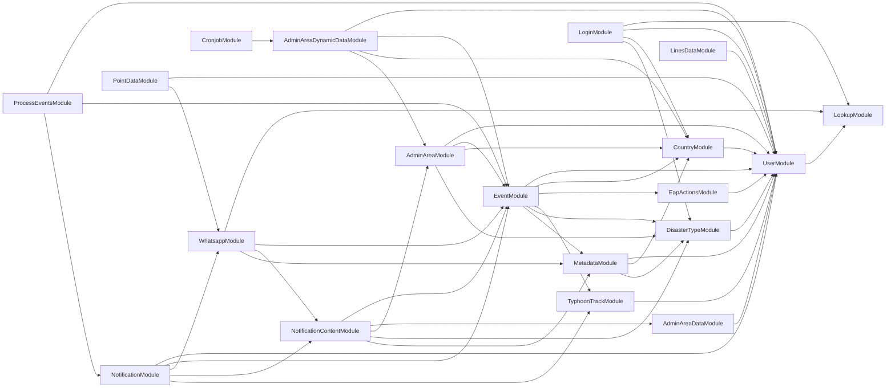

# Module Dependencies Graph

```mermaid
graph LR
  EapActionsModule-->UserModule
  UserModule-->LookupModule
  AdminAreaModule-->UserModule
  AdminAreaModule-->EventModule
  EventModule-->UserModule
  EventModule-->CountryModule
  CountryModule-->UserModule
  EventModule-->EapActionsModule
  EventModule-->TyphoonTrackModule
  TyphoonTrackModule-->UserModule
  EventModule-->DisasterTypeModule
  DisasterTypeModule-->UserModule
  EventModule-->MetadataModule
  MetadataModule-->UserModule
  MetadataModule-->CountryModule
  MetadataModule-->DisasterTypeModule
  AdminAreaModule-->CountryModule
  AdminAreaModule-->DisasterTypeModule
  AdminAreaDynamicDataModule-->UserModule
  AdminAreaDynamicDataModule-->EventModule
  AdminAreaDynamicDataModule-->CountryModule
  AdminAreaDynamicDataModule-->AdminAreaModule
  ProcessEventsModule-->UserModule
  ProcessEventsModule-->EventModule
  ProcessEventsModule-->NotificationModule
  NotificationModule-->UserModule
  NotificationModule-->EventModule
  NotificationModule-->WhatsappModule
  WhatsappModule-->LookupModule
  WhatsappModule-->EventModule
  WhatsappModule-->NotificationContentModule
  NotificationContentModule-->EventModule
  NotificationContentModule-->AdminAreaDataModule
  AdminAreaDataModule-->UserModule
  NotificationContentModule-->AdminAreaModule
  NotificationContentModule-->DisasterTypeModule
  NotificationContentModule-->MetadataModule
  WhatsappModule-->MetadataModule
  NotificationModule-->NotificationContentModule
  NotificationModule-->TyphoonTrackModule
  PointDataModule-->UserModule
  PointDataModule-->WhatsappModule
  LinesDataModule-->UserModule
  CronjobModule-->AdminAreaDynamicDataModule
  LoginModule-->LookupModule
  LoginModule-->UserModule
  LoginModule-->CountryModule
  LoginModule-->DisasterTypeModule
```
