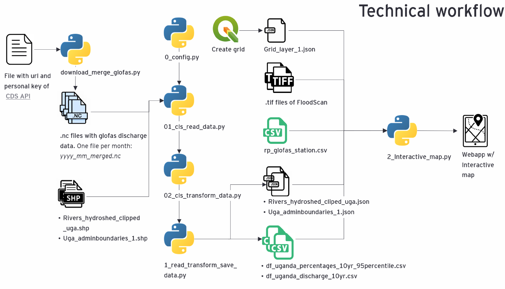

# Documentation for Red Cross Netherlands regarding the GloFAS station selection tool (Uganda)
This document dives into the data and scripts used to build the GloFAS station selection tool. This tool is a Dash webapp that can be used to tdermine which districts are connected to (GloFAS) stations, to specify the exact flood-prone areas (FloodScan data), and can be used as a starting point for optimising station locations. This project focussed on Uganda only, but the tool can easily be extended with other countries.

<u> Authors: </u>  
Janno Bannink, janno.bannink@vodw.ey.com  
Lisanne van Brussel, lisanne.van.brussel@vodw.ey.com

### Table of Contents
- [1. Technical workflow](#1.-technical-workflow)
- [2. Download GloFAS discharge data ](#2.-download-glofas-discharge-data)
- [3. Read, transform and combine data](#3.-read,-transform-and-combine-data)
- [4. GloFAS station selection tool / Interactive map](#4.-GloFAS-station-selection-tool-/-Interactive-map) 

### 1. Technical workflow
Below, the technical workflow with all data and scripts used to create the GlofAS station selection tool can found.
In the next chapters of this README, a more detailed description of the data and scripts will be given. Be aware that the description is an high-over description, more details can be found in the project document `project_document_glofas_station_selection_tool.pdf` or within the scripts itself.

Figure 1: Schematic overview of the pipeline
)

### 2. Download GloFAS discharge data 
`download_merge_glofas.py` can be used to download worldwide GloFAS discharge data for the years/months specified in the script. One should have an account (with personal key) at the Climate Data Store (CDS) or Atmosphere Data Store (ADS) to do so. Running this script will download the data and saves a `.nc` file for each month of GloFAS data.

### 3. Read, transform and combine data

#### Input files
* `.nc` files with daily GloFAS discharge data of 2010-2019 (worldwide).
* Shapefiles of rivers and admin boundaries of Uganda:
    * `rivers_hydroshed_clipped_uga.shp`
    * `uga_adminboundaries_1.shp`
    
#### Scripts
There are four `.py` scripts that together read, transform and save the data :  

* `0_config.py`: The script `0_config.py` contains the configuration dictionary with all settings needed to read, prepare and transform the data. The (most important) settings that can be changed are:
    * Path (i.e.. directory) to the folder with the downloaded GloFAS data: `path_discharge_gridcells`.
    * Boundaries of the country interested in: `lat_min`, `lat_max`, `lon_min`, `lon_max`.
    * Percentile of the 10 year return period to identify the days with extreme discharge levels: `percentile`. 
    * Rounds of neighbours surrounding the selected cell (integer, 1 = 8 neighbours, 2 = 24 neighbours): `neighbor_rounds`.
    * Number of files, can be changed if you don`t want to read all the data (time consuming): `nr_files`.
    * Indicator (Boolean) whether to save the created data: `save_final_data`.
    * Path to the folder where, newly created, data should be saved: `path_final_data`.
    
* `01_cls_read_data.py`: This class imports `0_config.py`. reads in the `.nc` files and shapefiles. The shapefiles will be transformed and saved to `.json` files. Besides, all GloFAS discharge data will be merged to one pandas dataframe. Here, rows are the dates and the columns are the coordinates (lat_lon) of each grid cell. 

* `02_cls_transform_save_data.py`: This class imports `01_cls_read_data.py`. Besides others, it creates a pandas dataframe with dummies to identify extreme discharges per day/gridd cell, and a pandas dataframe with the percentage of overlap of extreme discharge days of a cell and its adjacent (neighboring) cells. These files will be saved as `.csv` files. More details about the methodology can be found in the project document `project_document_glofas_station_selection_tool.pdf`. 

* `1_read_transform_save_date.py`: This class imports `02_cls_transform_save_data.py` and makes sure that the classes are executed. When running this script, the data will actually be loadded, transformed and saved. 

Once the settings in `0_config.py` are modified, the classes `01_cls_read_data.py` and `02_cls_transform_data.py` can be used. However, make sure that the path specified in the first lines within both scrips is right. This should be the path of the scripts.

#### Output files
* `df_uganda_discharge_10yr.csv` : Daily GloFAS discharge data (2010-2019) of all grid cells within Uganda.
* `df_uganda_percentages_10yr_95_percentile.csv` : Data with percentages of overlap of extreme discharge days of a cell and its adjacent (neighbouring) cells.
* Shapefiles as `.json`:
    * rivers_hydroshed_cliped_uga.json
    * uga_adminboundaries_1.json

### 4. GloFAS station selection tool / Interactive map

#### Input files
* `Grid_layer_1.json`: .1°x .1° degree grid cells of Uganda as explained in previous slide.
* `FloodScan geoTIFF files`: FloodScan supplies their data using the geoTIFF format. These (Tagged Image Files) often contain one or multiple layers of information, as well as contains geospatial metadata. 
* `rp_glofas_station.csv`: csv-file with all 'virtual' GloFAS stations names and locations.
* `Rivers and admin boundaries jsons`: the to json transformed shapefiles with the river network and admin boundaries (districts) of Uganda. These will be saved when running `1_read_transform_save_data.py`. 
* `GloFAS discharge data and percentage overlap data`: File with the GloFAS discharge data of 2010-2019 and all grid cells of Uganda (`df_uganda_discharge_10yr.csv`). File with the percentage of overlap of extreme discharge days of a cell and its adjacent (neighbouring) cells (`df_uganda_percentage_10yr_95percentile.csv`). These files will be saved when running `1_read_transform_save_data.py`. 

#### Script `2_interactive_map.py`
The script that creates the GloFAS station selection tool is `2_interactive_map.py`. It contains several functions for the app to function correctly. The required functions are listed below. Documentation and explanation on these functions can be found within the script.

* `select_neighbours_percentages`
* `show_discharge_graph`
* `get_flood_polygons`
* `get_districts`
* `get_color`

#### Output
When runninb the script in its entirety it will deploy the app on a local development server. The GloFAS station selection tool can be accessed by copy-pasting 'http://127.0.0.1:8050/' in your (Chrome) browser. 

When the tool is deployed and running in your browser you will see a map, several sliders and buttons and an empty linegraph. The following section will describe the function of each of these features: 

##### <u> Map </u>
Contains several layers:

* Black lines. administration borders
* Blue lines, rivers 
* White dashed lines, boundaries of the grid cells

##### <u> Controls </u>
Currently, it is possible to select each grid cell within the bounding box of Uganda. By selecting a grid cell a path will form of the grid cells with the highest overlapping percentage (extreme discharge days are often similar).The shade of blue indicates the overlapping percentage (darkblue = a high overlapping percentage). 

Whenever there are a lot of grid cells with high overlapping percentages, the path will become longer untill it has reached its limit (default: 10). By adjusting the top left slider: 'number of steps' the path size limit can be increased up to a 100 grid cells. Moreover, it is possible the adjust the minimal percentage of overlapping extreme discharge days between grid cells. The default percentage is 60%, which is arbitrary. It is recommended to play around with these settings to get the desired results, also depending on the goal and country.  

Below the two sliders there are buttons which can be turned on and off. The first button, `Show stations`, visualizes the locations of the current virtual GloFAS stations. The second button, `Show floods`, visualises past floods, according to FloodScan. We should note that loading the floods may take some time depending on the number of days selected in the `Date range FloodScan data`. Indicated by red pixels, `Show floods` will visualize the areas that have been flooded within the selected date range.  

Once you have chosen a grid cell, and adjusted the sliders to your preference you will see the connected districts beneadth the 'Show stations' button. The connected districts are both up- and downstream the selected cells. 

Lastly, on the right side of the map you will see the GloFAS discharge of the particular cell in the available time period. The red line within this graph indicates the 95 percentile. Whenever the discharge is above the red line, the discharge within that cell is considered 'extreme'. Using your mouse it is possible to see the exact values from an exact date. Moreover, it is possible to zoom-in to a particular area of the graph. 

### 5. Creating a grid 
GloFas provides a gridded dataset at a 0.1° resolution. The GloFAS Station Selection (GSS) tool uses an identical grid as an overlay. There are several ways to generate this grid. The following section contains a description of the approach we took to replicate the GloFAS grid using Qgis.

##### <u> Creating a GloFAS grid in Qgis </u>
For each grid cell, GloFAS provides the coordinates of the middle (e.g. lon: 29.55, lat: 1.55). However, knowing that GloFAS uses a 0.1° grid, the boundaries of each grid cell extent to .05° degrees in all four directions from the middle. Resulting in a polygon with the following coordinates: xmin: 29.5, xmax: 29.6, ymin: 1.5, ymax: 1.6). 

Using the example in figure 2, the middle is indicated by a yellow point. The (black) boundaries extent .05° from that middle point. Creating a GloFAS grid requires starting (xmin, ymin) to start at a .1° interval. 

To create a grid using Qgis (version: 3.1.10), select 'Vector' -> 'Research tools'-> 'Create Grid'. 
Which brings up the menu shown below. For the grid of Uganda, Grid type was set to 'Rectangle (Polygon)', which makes the eventual grid clickable, Grid Extent was set to the bounding box of Uganda (xmin: 29.5, xmax: 35.2, ymin: -1.5, ymax: 4.3). Moreover, the horizontal and veritcal spacing were set to .1° degrees and the Grid CRS was set to Default EPSG:4326 - WGS 84. Lastly, one can select the desired location (ie folder) for the shp file of the grid. 

The given settings result in a grid layer for Uganda, shown below. This grid is (virtually) identical to the grid GloFAS uses to determine the water discharge per m3. By saving the grid to a shapefile and loading it to the GSS tool the clickable overlay is created. 

